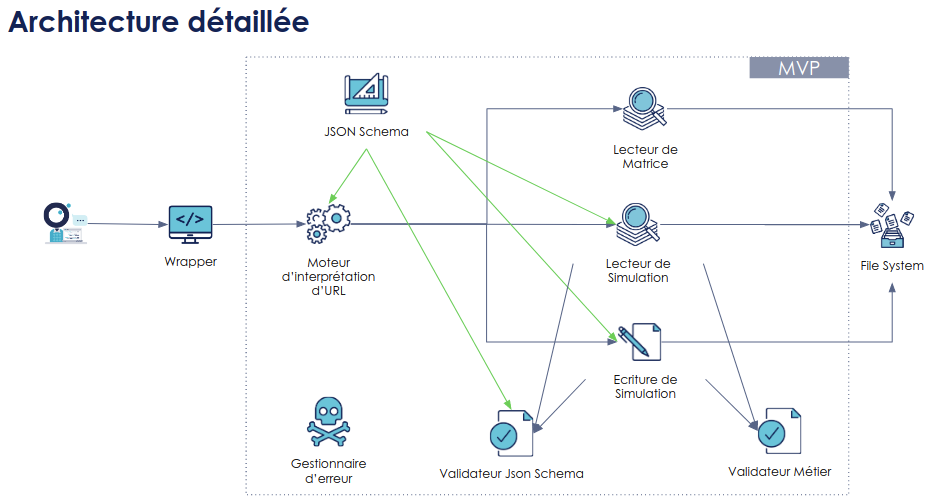

# AntaREST Storage

[](https://github.com/AntaresSimulatorTeam/AntaREST/actions?query=workflow%3Amain)
[](https://sonarcloud.io/dashboard?id=AntaresSimulatorTeam_api-iso-antares)
[](https://www.apache.org/licenses/LICENSE-2.0)

<!--  -->

## Build the API

First clone the projet:

```shell script
git clone https://github.com/AntaresSimulatorTeam/api-iso-antares.git
cd api-iso-antares
```

### Using pyinstaller

Linux system:

```shell script
pyinstaller -F api_iso_antares/main.py -n server --add-data resources:resources
```

Windows system:

```shell script
pyinstaller -F api_iso_antares\main.py -n server --add-data ".\resources;.\resources"
```

You can test the build is ok using:

```shell script
dist/server -v       # Linux based system
dist\server.exe -v   # Windows system
```

### Using docker

To build the docker image, use the following command:

```shell script
docker build --tag api-iso-antares -f docker/Dockerfile .
```

## Start the API

### Using builded binary with pyinstaller

```shell script
dist/server -s $STUDIES_ABSOLUTE_PATH         # Linux based system
dist\server.exe -s %STUDIES_ABSOLUTE_PATH%    # Windows system
```

* $STUDIES_ABSOLUTE_PATH is the path of the ANTARES studies folders you wish to manipulate

### Using docker image

```shell script
docker run \
  -p 80:5000 \
  -e GUNICORN_WORKERS=4 \
  -v $STUDIES_ABSOLUTE_PATH:/studies \
  api-iso-antares
```

* Setting the environment variable GUNICORN_WORKERS to *ALL_AVAILABLE* will make GUNICORN use 2 * nb_cpu +1 workers
    * https://docs.gunicorn.org/en/stable/design.html#how-many-workers
    * ALL_AVAILABLE is also the default value of GUNICORN_WORKERS if you do not set it
* $STUDIES_ABSOLUTE_PATH is the path of the ANTARES studies folders you wish to manipulate
    * If you do not mount */studies* to a host path, the docker image will use the current path as the studies path
* An exemple is available in this repo in the *script* folder

### Using python directly

#### Using the dev wsgi server of Flask

```shell script
pip install -r ./requirements.txt
export PYTHONPATH=$PYTHONPATH:.
python ./api_iso_antares/main.py -s $STUDIES_ABSOLUTE_PATH
```

* $STUDIES_ABSOLUTE_PATH is the path of the ANTARES studies folders you wish to manipulate
* An exemple is available in this repo in the *script* folder

#### Using gunicorn wsgi server

```shell script
pip install -r ./requirements.txt
export PYTHONPATH=$PYTHONPATH:.

export API_ANTARES_STUDIES_PATH=$STUDIES_ABSOLUTE_PATH
export GUNICORN_WORKERS=4

gunicorn --config "$YOUR_GUNICORN_CONFIG" api_iso_antares.wsgi:app
```

* $YOUR_GUNICORN_CONFIG is the path of a gunicorn server configuration file
    * An example is available in this repo in the *conf* folder
* Setting the environment variable GUNICORN_WORKERS to *ALL_AVAILABLE* will make GUNICORN use 2 * nb_cpu +1 workers
    * https://docs.gunicorn.org/en/stable/design.html#how-many-workers
    * ALL_AVAILABLE is also the default value of GUNICORN_WORKERS if you do not set it
* An exemple is available in this repo in the *script* folder

## Examples

Once you started the server, you have access to the API.
The address (the port mostly) depends of the way you started the server. If you start the server
* via python use: **http://0.0.0.0:8080**
* via gunicorn use: **http://0.0.0.0:5000**
* via docker use: **http://0.0.0.0:80** (if you use the parameter *-p 80:5000*)

To test the server, you can list the available studies in your workspace using:

```shell script
curl http://0.0.0.0:8080/studies
```

Or data of a specific study using:

```shell script
curl http://0.0.0.0:8080/studies/{study_uuid}
```

The current API handle hundreds of html end point (get and post) to manipulate your studies.
The best way to discover the API is using it's swagger documentation (see below).

## Swagger

The ANTARES API do not have a public UI swagger available for the moment.
Use the following command to save the swagger metadata of the API ANTARES into a json file.

```shell script
curl http://0.0.0.0:8080/swagger > swagger.json
```

Then, use the script *script/swagger-ui.sh* to start a Swagger UI.

```shell script
chmod a+x ./script/swagger-ui.sh
./script/swagger-ui.sh
```

Do not forget to start the API ANTARES alongside (and to modify the port you decide to use into the Swagger UI).


## Strategies for JssonSchema Engines

| Strategy | Description                           |
|----------|---------------------------------------|
| S1       | Mix folder with complete set of zones |
| S...     |                                       |
| Sn       |                                       |

