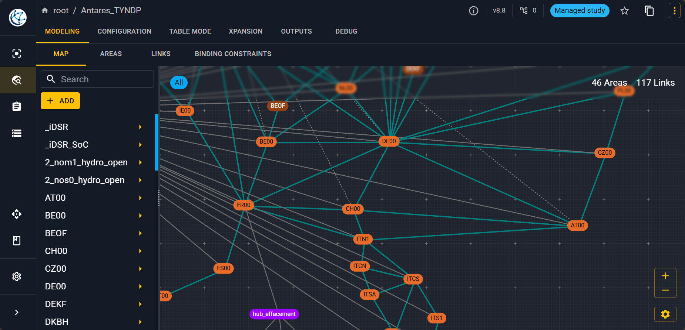

<div align="center">

# Antares Web

**A modern web application for managing and editing [Antares Simulator](https://antares-simulator.org) studies**

[](https://github.com/AntaresSimulatorTeam/AntaREST/actions?query=workflow%3Amain)
[](https://sonarcloud.io/dashboard?id=AntaresSimulatorTeam_api-iso-antares)
[](https://www.apache.org/licenses/LICENSE-2.0)
[](https://www.python.org/downloads/)
[](https://reactjs.org/)

[Documentation](https://antares-web.readthedocs.io/) • [Installation](#installation) • [Contributing](./CONTRIBUTING.md) • [Issues](https://github.com/AntaresSimulatorTeam/AntaREST/issues)

</div>



---

## About

**Antares Web** is a web platform developed by RTE to manage, configure, 
and interact with Antares Simulator which is part of 
[Antares](https://antares-doc.readthedocs.io/en/latest/), RTE backed adequacy simulation software 
for power system studies. Antares Simulator is an open-source power system simulator 
that enables detailed modeling of energy consumption, generation, and transportation, 
performing probabilistic simulations across year-long scenarios with 8760 hourly time-frames.

Antares Web provides a modern REST API and web interface for managing Antares Simulator studies, 
adding powerful features for collaboration, storage optimization, and advanced editing capabilities.

### Key Features

- **RESTful API**: Complete API for programmatic access to studies and simulations
- **Modern Web Interface**: React-based UI for intuitive study management and editing
- **Application Interoperability**: Unique study IDs and standardized endpoints for easy integration
- **Optimized Storage**: Matrix data extraction and sharing between studies, with archive mode support
- **Variant Management**: Advanced editing description language and generation tools
- **User Management**: Complete user accounts and permission system
- **Multi-mode Deployment**: Run as a web server, desktop application, or Docker container

---

## Table of Contents

- [Prerequisites](#prerequisites)
- [Installation](#installation)
  - [Quick Start (Development)](#quick-start-development)
  - [Using Docker](#using-docker)
  - [Building a Desktop Application](#building-a-desktop-application)
- [Usage](#usage)
  - [Running the Application](#running-the-application)
  - [API Documentation](#api-documentation)
- [Development](#development)
  - [Running Tests](#running-tests)
  - [Code Quality](#code-quality)
- [Documentation](#documentation)
- [Deployment](#deployment)
- [Contributing](#contributing)
- [License](#license)
- [Support](#support)

---

## Prerequisites

Before you begin, ensure you have the following installed:

- **Python**: 3.11.x ([Download](https://www.python.org/downloads/))
- **Node.js**: 22.13.0 ([Download](https://nodejs.org/))
- **Git**: Latest version ([Download](https://git-scm.com/))

Optional (for specific deployment modes):
- **Docker**: For containerized deployment
- **PostgreSQL**: For production database (SQLite used by default for development)
- **Redis**: For production caching

---

## Installation

### Quick Start (Development)

1. **Clone the repository**

   ```bash
   git clone https://github.com/AntaresSimulatorTeam/AntaREST.git
   cd AntaREST
   ```

2. **Install Python dependencies**

   ```bash
   uv sync  # Install all dependencies including dev
   ```

4. **Install frontend dependencies**

   ```bash
   cd webapp
   npm install
   cd ..
   ```

5. **Run the application**

   See the [Running the Application](#running-the-application) section below for detailed instructions on running in development, production, or desktop mode.

### Using Docker

Build the Docker image:

```bash
docker build --tag antarest .
```

Run with default configuration:

```bash
docker run -p 8080:5000 -e GUNICORN_WORKERS=1 antarest
```

For production deployment with external database and Redis, see the 
[deployment documentation](https://antares-web.readthedocs.io/en/latest/developer-guide/install/2-DEPLOY.html).

## Usage

### Running the Application

**Development mode (with auto-reload):**

Run both backend and frontend in separate terminals:

```bash
# Terminal 1 - Backend
python antarest/main.py -c resources/application.yaml --auto-upgrade-db --no-front

# Terminal 2 - Frontend
cd webapp
npm run dev
```

The API will be available at `http://localhost:8080` and the frontend at `http://localhost:3000`

**Production mode (with Gunicorn):**
```bash
export ANTAREST_CONF=resources/application.yaml
export GUNICORN_WORKERS=4
uv run gunicorn --config conf/gunicorn.py --worker-class=uvicorn.workers.UvicornWorker antarest.wsgi:app
```

**Note**: In production, we now use an alternative deployment mode where Gunicorn is not used 
for load balancing. Instead, we start multiple independent workers on different ports, 
allowing upstream load balancing to be handled by tools like nginx.

### API Documentation

Once the server is running, you can access:

- **Interactive API documentation (Swagger)**: `http://localhost:3000/apidoc`
- **OpenAPI specification**: `http://localhost:8080/openapi.json`

**Example API calls:**

```bash
# List all studies
curl http://localhost:8080/v1/studies

# Get specific study details
curl http://localhost:8080/v1/studies/{study_uuid}

# Create a new study
curl -X POST http://localhost:8080/v1/studies \
  -H "Content-Type: application/json" \
  -d '{"name": "My Study", "version": "860"}'
```

---

## Development

### Running Tests

The project uses `pytest` for testing:

```bash
# Run all tests in parallel
pytest -n auto
```

### Code Quality

**Linting and formatting (with Ruff):**
```bash
# Check and fix code style
ruff check antarest/ tests/ --fix

# Format code
ruff format antarest/ tests/
```

**Type checking (with mypy):**
```bash
mypy
```

---

## Documentation

- **Antares user documentation including on using Antares Web**: [antares-doc.readthedocs.io](https://antares-doc.readthedocs.io/en/latest/)
- **Antares Web technical documentation**: [antares-web.readthedocs.io](https://antares-web.readthedocs.io/en/latest/)

---

## Contributing

We welcome contributions from the community! Whether you're fixing bugs, 
adding features, or improving documentation, your help is appreciated.

Please read our [Contributing Guide](./CONTRIBUTING.md) to learn about:
- Setting up your development environment
- Code style and standards
- Submitting pull requests
- Reporting issues

---

## License

This project is licensed under the Apache License 2.0 - see the [LICENSE](LICENSE) file for details.

Copyright © 2007-2026 RTE (https://www.rte-france.com)

---

## Support

- **Issues**: [GitHub Issues](https://github.com/AntaresSimulatorTeam/AntaREST/issues)
- **Discussions**: [GitHub Discussions](https://github.com/AntaresSimulatorTeam/AntaREST/discussions)

---

<div align="center">

**[⬆ back to top](#antares-web)**

</div>