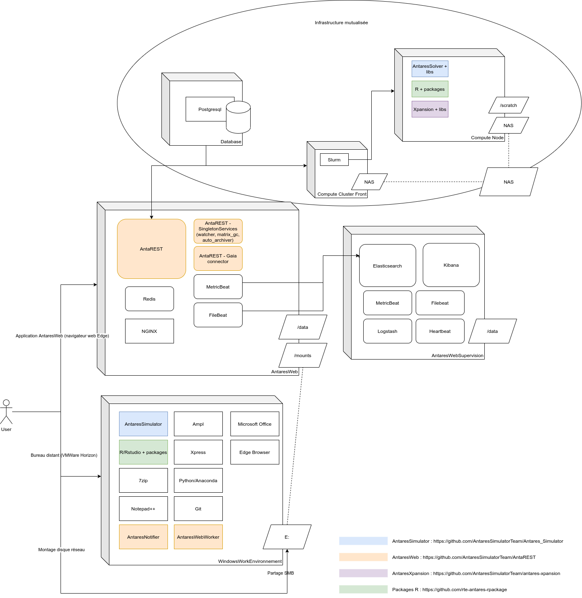
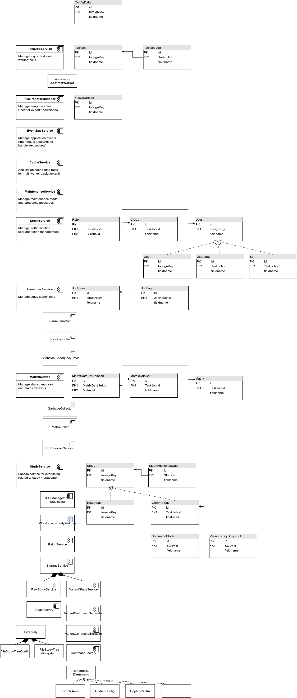

# Architecture overview

## Full deployment

## Entry points / applications

The project has multiple entrypoints corresponding to different application module or 
method of launching the main application :
- main.py : define the main application and is used to run the server in a standalone development mode (single worker)
- wsgy.py : define the wsgi app (using main.py) that will be run via gunicorn server on a multi worker production server
- gui.py : define the application run as a desktop application
- archive_worker_service.py : define a worker that unzip study results on remote windows nodes (see the deployment diagram)
- admin.py : define a cli app to run administrative tasks (used on production deployments)
- cli.py : define a cli app with various utilities

## Main packages and services

Each package/module is structured in the following way :
- service.py : define the main service or service facade of the package
- web.py : define the api rest endpoints (can be a directory containing split blueprints)  
- main.py : contains a method build_<service_name> that construct the service and blueprint, declaring the necessary dependencies
- model.py : define the data models (Business object, DTO and Database Entities), can also be a directory to split in multiple files
- repository.py : define an utility class that will allow to query the database entities defined in the model
- business / common / utils / ... : other directory to put business components, utility, interfaces, adapters, ...

## Specific topics

- [Database management](./1-database.md)
- [Adding a new antares simulator version support](./2-add-new-antares-version.md)

