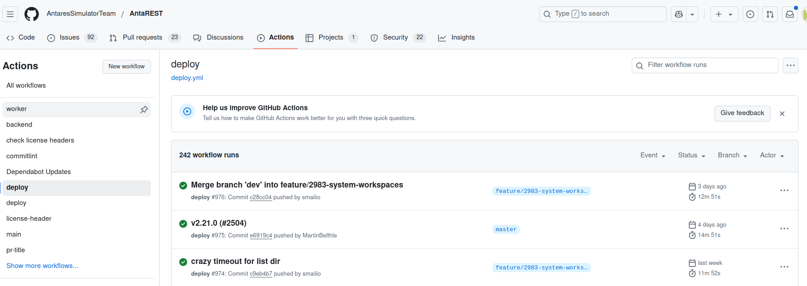

# Developer Guide: Desktop Version  

This document is intended to help new developers get started with testing and building the desktop version locally.  

## Running the Desktop Version Locally  

To run the desktop version locally, follow these steps:  

1. **Build the artifact locally**:  
    Run the following script to build the artifact:  
    ```bash  
    scripts/package_antares_web.sh  
    ```  

2. **Navigate to the distribution folder**:  
    ```bash  
    cd ./dist/package  
    ```  

3. **Run the application**:  
    ```bash  
    ./AntaresWeb/AntaresWebServer  
    ```  

## Understanding the Build Process  

The process of building the artifact is defined in the GitHub Actions workflow file 
[deploy.yml](../../.github/workflows/deploy.yml)
You can review this file to understand how the artifact is built.  

## Triggering the Build via GitHub Actions  

If you want the GitHub Action to build the artifact for your branch:  

1. Add your branch name to the `on.push.branches` section in the `deploy.yml` file.  Like this 
```yaml
name: deploy
on:
  push:
    branches:
      - "master"
      - "hotfix/**"
      - "your_branch_name"  # Replace with your branch name if needed
```
2. Push your changes to the branch.  

The GitHub Action will be triggered, and the artifact will be built.  

## Retrieving the Artifact  

Once the build is complete, you can retrieve the artifact from the **Actions** tab on GitHub under the **Deploy** section.  




## Updating the Default Configuration  

To update the default configuration of the desktop version, you need to modify the `config.yaml` file located in the `resources/antares-desktop-fs` directory.  


## When to use the antares-web-installer  

As a new developper you noticed that we provide to our user an installer. However you don't always need to use it for local testing.

When you make an update to the `config.yaml` file located in the `resources/antares-desktop-fs` directory and you want this update to be retroactive, then you should updtate the installer code so that it applies the update on existing user installation.