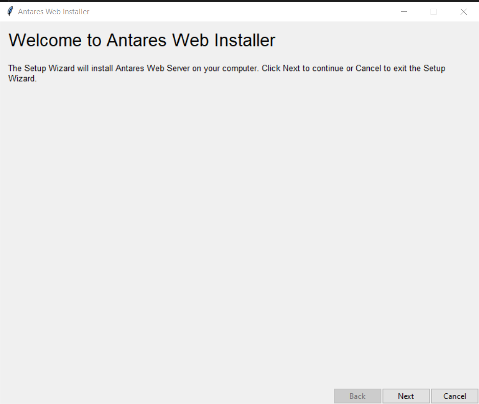

# Deployments

This application can be used in two modes:

- a production dockerized environment
- a local desktop application

## Production server deployment

The production server deployment uses `docker` and `docker-compose` to run the following containers:

- antarest: the web application workers
- antarest-watcher: the workspace scanner worker
- antarest-matrix-gc: the matrices garbage collector worker 
- redis: the cache that allows the multiple application server workers to synchronize
- postgresql: the database
- nginx: the web server front end (can be used to set up ssl)

The following example shows how to deploy this simple base environment.

### Example deployment steps

Requirements:

- a linux host
- docker
- docker-compose

These steps should work on any linux system with docker and docker-compose installed.

1. First, the steps 1 and 3 of the [quick start build](0-INSTALL.md#quick-start) must have been done. So this guide will assume that you have previously cloned the [code repository](https://github.com/AntaresSimulatorTeam/AntaREST),
   the frontend built and that your working directory is at the root of the project.

2. Then download and unzip AntaresSimulator binaries:

   ```shell
   wget https://github.com/AntaresSimulatorTeam/Antares_Simulator/releases/download/v8.8.14/antares-8.8.14-Ubuntu-20.04.tar.gz
   tar xzf antares-8.8.14-Ubuntu-20.04.tar.gz
   ```

3. Build the docker image

   ```shell
   docker build -t antarest:latest .
   ```

4. Prepare the environment (This is important, in order to prevent docker containers to write files into your file system with root permissions.)  

   a. Copy `docker-compose.override.yml.example` to `docker-compose.override.yml` and replace the UID and GUI values with your user's one.

      You can get these values by running the following commands:

      - UID: `id -u`
      - GID: `id -g`

   b. Create the directory `resources/deploy/db`

5. Run the following command to spin up the application containers:  

   ```shell
   docker-compose up
   ```

6. You can then access the application at http://localhost

7. To stop the application you can juste hit "CTRL-C" to end the containers.
   
This is an example of a deployment.
You'll have to edit your own `docker-compose.yml` file and [`application.yaml` configuration](./1-CONFIG.md) to customize it to your needs.

## Local desktop application

The local application is a bundled build of the web server to ease its launch as a kind of desktop application.  
When started, the application will be shown as a systray application (icon in the bottom right corner of the Windows bar). The menu will allow to go to the local address where the interface is available.

The build is directly available in the [release](https://github.com/AntaresSimulatorTeam/AntaREST/releases) files for each version.

You can download the latest version here:

- [For Windows](https://github.com/AntaresSimulatorTeam/AntaREST/releases/download/v2.18.0/AntaresWeb-windows-v2.18.0.zip)
- [For Ubuntu 20.04 ](https://github.com/AntaresSimulatorTeam/AntaREST/releases/download/v2.18.0/AntaresWeb-ubuntu_20.04-v2.18.0.zip)
- [For Ubuntu 22.04](https://github.com/AntaresSimulatorTeam/AntaREST/releases/download/v2.18.0/AntaresWeb-ubuntu_22.04-v2.18.0.zip)

The local application contains an installer program that you can use to manage the installation. 
This program will keep your local data while updating the functional parts of the server.

### GUI installer (windows only)

Double-click on the AntaresWebInstaller.exe executable and follow the instructions. 
In case you already have a local application, choose your current application path in order to update it.



### CLI installer (linux only)

Open a new command prompt or powershell instance.
Run the following command:

```
AntaresWebInstaller -t <TARGET_DIR>
```

where `<TARGET_DIR>` is the directory where you want to install the Antares Web Desktop.

Note that you can specify an existing directory as value of `TARGET_DIR`, in which case the installer will update the
existing installation.

By default, the installer will generate shortcuts and launch the server at the end of the installation, but you
optionally can decide to deactivate these steps with `--no-shortcut` and `--no-launch`.

Run ```AntaresWebInstaller --help``` for more options.