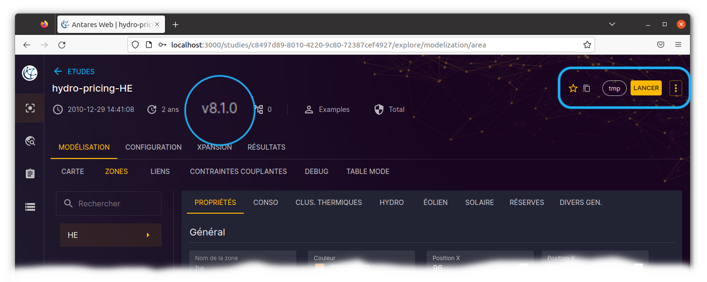
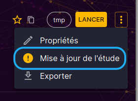
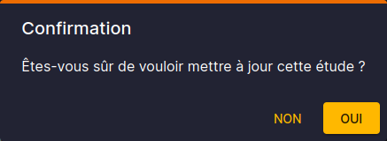
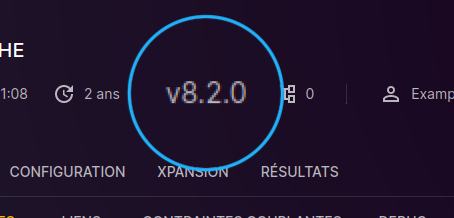

# Introduction

Upgrading versioned studies is an important step to ensure compatibility of your studies with the latest versions of
Antares Web and Antares Simulator. This upgrade is necessary because some earlier versions may be deprecated and no
longer supported.

The upgrade process involves updating your study to the latest available version, using an automated process that
ensures consistency of results across versions. This upgrade may include minor or major changes to the structure of the
study.Generally, the changes are related to the configuration, the creation of new folders to take into account new
functionalities (adequacy patch, xpansion, etc.) but also the upgrade of matrices.

> Please note that upgrading your study to the latest version of Antares Simulator does not automatically enable new
> features, and may require manual adjustments to your study to take full advantage of the new capabilities.

We strongly recommend upgrading your studies to the latest version to take advantage of all the new features, and
improvements in Antares Web and Antares Simulator. If you encounter any difficulties during the upgrade, please do not
hesitate to contact our support team for assistance.

# Upgrading

To upgrade your study to the latest version of Antares Web and Antares Simulator, you can follow these steps:

On the main page of the study, you can find the version number at the top of the menu bar:

To upgrade the study, click on the nemu and select "Upgrade Study".

The confirmation dialog box will appear, click "Yes" to start the upgrade:

The upgrade task is launched in the task manager.

> **NOTE:** Most of the upgrades are instantaneous but some can take time, especially when there are matrix
> transformations.

When the upgrade is done, you can see the version number updated:

Once the upgrade is complete, you can open your study and perform the manual upgrade in the configuration.

# See also

- Create a new study in the latest version
- Run a study in the latest version 
