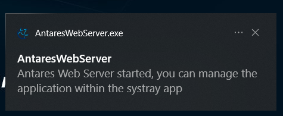
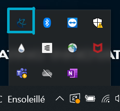

[![Status][ci_result]][ci_result_link] [![Quality Gate Status][coverage_result]][coverage_result_link] [![License][license_badge]][license_link]


> Web API and UI for [Antares Simulator][antareswebsite]

This package works along with RTE's adequacy software [Antares Simulator][antareswebsite] that is also [hosted on github][antares-github]

Please see the [Antares Web Documentation][readthedocs] for an introductory tutorial,
and a full user guide. Visit the [Antares-Simulator Documentation][readthedocs-antares] for more insights on ANTARES. 

## Introduction

`antares-web` is a server api interfacing Antares Simulator solver and studies management. It provides a web application to manage studies
adding more features to simple edition.

This brings:

> - **application interoperability** : assign unique id to studies, expose operation endpoint api
>
> - **optimized storage**: extract matrices data and share them between studies, archive mode
>
> - **variant management**: add a new editing description language and generation tool
>
> - **user accounts** : add user management and permission system

## Local installation

The local installation of this application use a bundled build of the web server to ease its launch as a kind of desktop application.

### For Windows

1. Download the lastest version [here](https://github.com/AntaresSimulatorTeam/AntaREST/releases/download/v2.14.3/AntaresWeb-windows-v2.14.3.zip.zip)
2. Unzip the package
3. Go into the directory **AntaresWeb-windows-vX.X.X** (vX.X.X for the latest version)
4. Launch this file **AntaresWebServerShortcut** . (It's important to run the shortcut and not the exe). You'll have this pop up



5. Then go to [http://localhost:8080](http://localhost:8080), you can now use it.


When started, the application will be shown as a systray application (icon in the bottom right corner of the Windows bar)



### For Linux

1. Download the lastest version [here](https://github.com/AntaresSimulatorTeam/AntaREST/releases/download/v2.8.0/AntaresWeb-ubuntu-v2.8.0.zip)
2. Open a terminal where the zip was downloaded, unzip the package and go into the directory **AntaresWeb-ubuntu-vX.X.X** (vX.X.X for the latest version)
```
unzip AntaresWeb-ubuntu-vX.X.X.zip
cd AntaresWeb-ubuntu-vX.X.X
```
3. Run this command to launch antaresWeb
```
./AntaresWeb/AntaresWebServer
```
4. Then go to [http://localhost:8080](http://localhost:8080), you can now use it.


## Documentation

- [Using the application](./user-guide/0-introduction.md)
- [Building the application (for developers)](./install/0-INSTALL.md)
- [Contributing to the application code](./architecture/0-introduction.md)


`Antares-Web` is currently under development. Feel free to submit any issue.


[ci_result]: https://github.com/AntaresSimulatorTeam/AntaREST/workflows/main/badge.svg
[ci_result_link]: https://github.com/AntaresSimulatorTeam/AntaREST/actions?query=workflow%3Amain
[coverage_result]: https://sonarcloud.io/api/project_badges/measure?project=AntaresSimulatorTeam_api-iso-antares&metric=coverage
[coverage_result_link]: https://sonarcloud.io/dashboard?id=AntaresSimulatorTeam_api-iso-antares
[license_badge]: https://img.shields.io/github/license/AntaresSimulatorTeam/AntaREST
[license_link]: https://www.apache.org/licenses/LICENSE-2.0

[antares-github]: https://github.com/AntaresSimulatorTeam/Antares_Simulator
[readthedocs]: https://antares-web.readthedocs.io/
[readthedocs-antares]: https://antares-simulator.readthedocs.io/
[antareswebsite]: https://antares-simulator.org
