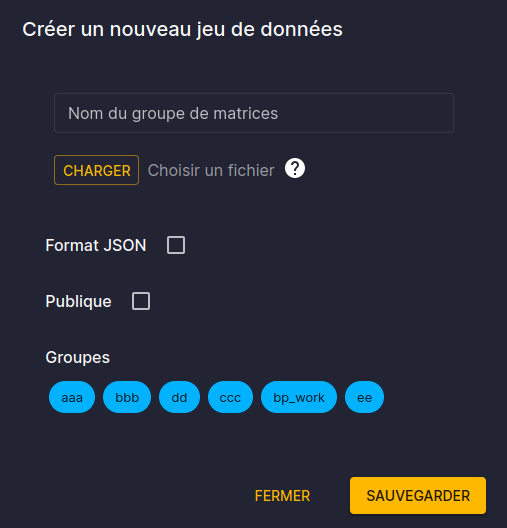

# User interface

## What's new (2.5.0)

- [Launch batch mode](#launch-batch-mode)
- [Strict folder filtering](#strict-folder-filtering)
- [Zipped output retrieval](#launch-dialog)


The application is split in 3 main menus : Studies, Jobs and Data.
API documentation, external reference links and user account details is also available.

  - "Studies" is the main section and redirects to the study listing where we can browse studies and work 
on them.
  - "Jobs" is a monitoring section which display currently running or latest execution jobs
  - "Data" is a section where we can manage matrix data that can be then used in the [variant manager](#variant-management)


## Study listing

The study listing view is the main view, which provides :
- the listing of existing studies
- filters/sorting/tree view
- creation/import tool

Studies are linked to a "workspace" which refers to a storage disk. The workspace "default" (orange colored) is
the internal storage where "managed" studies live. These studies files aren't meant to be accessible directly (via disk mount for instance).  
The other workspaces are studies that are found on mounted workspace and their unique ID can change if the studies are moved.

Copied studies are always copied within the managed workspace. These managed studies though not directly accessible offers additional features:
- a permanent ID
- archiving
- variant creation
- faster operations
- storage improvements


Some actions are available from this view:
- launching the study simulation
- exporting the study
- deleting the study


### Launch Dialog

When launching a study, a dialog will open with some choices.


### Launch batch mode

To launch multiple studies at once, we can click on the checkbox icon to enable selection mode. In this mode, we can click
on study cards to select / unselect them. Then clicking on the launch button will open
the launch dialog.


### Strict folder filtering

The folder icon next to the breadcrumb path allow to filter (when activated) the studies to only the direct descendant of the selected folder. 


For more operation over a study, we can click on a study "explore" button and go to the dedicated study view.
The url of dedicated study view can be bookmarked for sharing or quick access.

## Study view

The study view is composed of 2 or 3 main menus depending on the managed status of the study.
- ["Information"](#overview) view is an overview of the study
- ["Detailed view"](#detailed-view) is a raw view of the study contents
- ["Variant"](#variant-management) view is where we can manage the variant of a study if it is managed

### Overview

The overview provides access to :
- basic metadata
- name and permission edition (a study can be public or associated with groups with specific permissions)
- simulation execution monitoring
- variant dependency tree


### Variant management

The variant command tab is only available for managed variant studies.  
It shows an edition view where we can:
- edit the command list composing the variant
- monitor or verify the result of the generation process


### Detailed view

The detailed view is a tree representation of a study files. 
It can be browsed and node can be viewed and edited.  
:warning: The view can take some time to load the first time.


Example of the detailed view of a configuration node (ini files):


Example of the detailed view of a matrix node (txt data files):


## Data management

The data view display dataset which are list of matrices.
These matrices can then be used as argument in [variant manager commands](./2-variant_manager.md#base-commands).


The data which can be uploaded are either a single tsv file, or a zipped list of tsv matrix files.



## User account & api tokens

For normal user, the account section allows the creation of "api token".  
These token can be used in scripts that will use the [API](#api-documentation).


We can choose to assign specific permission to the token and can choose if the scripts using the token will impersonate our user or not.
If we choose the later, studies created using the token will be owned by a new user that will have the token's name.


We have to save the token (as it is generated once and not saved). It will then be used as an authentication token in HTTP Basic Auth, eg.:
```
curl -H 'Authorization: Bearer <my_token_string>' https://antares-web/api/studies
```


## API Documentation

The API documentation is an interactive documentation of HTTP endpoints that can be used to operate with the server.


