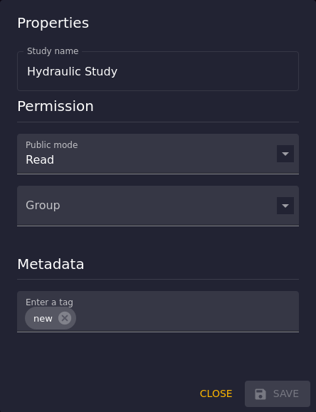

# How to Create a New Study?

Creating a new study in Antares Web is a straightforward process designed to facilitate users in setting up their energy
system simulations.
This guide will walk you through the steps to create a new study, from initial setup to finalization.

## Open the "Create Study" dialog

Navigate to the "Studies" pages to display the list of studies.
Click on the "Create" button to open the "Create Study" dialog box.


## Fill in Study Properties

In the "Create Study" dialog, you will be prompted to enter details about your study, such as:

- **Study Name**: Give your study a unique and descriptive name.
- **Version**: Select the version you wish to use, by default, the latest version is selected.
- **Permission**:
    - **Public Mode**: Select this option if you want to share your study with other users (it is recommended to
      select "READ" permission).
    - **Group**: Choose the groups you want to share your study with.
- **Metadata**:
    - **Tag**: Add tags to your study to help categorize and organize it (enter each tag, and presse Ctrl+Enter to add
      it).


Validate the form by clicking the "Save" button.

Your study is automatically saved in the `default` folder, which is the default folder of managed studies.

## Customize Study Properties

After creating your study, you can customize it further by moving it in a subfolder, changing its permission, or adding
metadata.

Select the `default` folder to display the list of studies in this folder.
Click on the "More options" button of your study to access the "Properties" and "Move" options.


### Move Study in a Subfolder

To move your study in a subfolder, click on the "Move" option.
The "Move Study" dialog opens, allowing you to select the destination folder.

Enter the name of the subfolder and validate by clicking the "Save" button.


If the subfolder does not exist, it will be created automatically.

### Edit the Study Properties

To edit the study properties, click on the "Properties" option.
The "Edit Study" dialog opens, allowing you to modify the study name, permission, and metadata:

- **Study Name**: Give your study a unique and descriptive name.
- **Permission**:
    - **Public Mode**: Select this option if you want to share your study with other users (it is recommended to
      select "READ" permission).
    - **Group**: Choose the groups you want to share your study with.
- **Metadata**:
    - **Tag**: Add tags to your study to help categorize and organize it (enter each tag, and presse Ctrl+Enter to add
      it).



Validate the form by clicking the "Save" button.

> **NOTE:** It is not possible to modify the version of a study after its creation,
> but you can still upgrade the version of the study.
> Refer to the [How to Upgrade a Study?](studies-upgrade.md) section for more information.

## Creating a Study Using the API Endpoint

The following Python script demonstrates how to create a study using the API endpoint `POST /v1/studies`:

You need to provide the following parameters:

- `name`: name of the study
- `version`: version of the study
- `groups`: list of groups to which the study will be assigned (optional)

Make sure you have the correct API URL and a valid authentication token.

```python
import httpx  # or requests

URL = "https://antares-web/api"
TOKEN = "<your authentication token>"

study = {
    "name": "My New Study",
    "version": 860,
    "groups": "group1, group2"
}

with httpx.Client(verify=False, headers={"Authorization ": f"Bearer {TOKEN}"}) as client:
    res = client.post(f"{URL}/v1/studies", params=study)

res.raise_for_status()
study_id = res.json()
```

The script above creates a new study named `My New Study` with version `860` and assigns it to the groups `group1`
and `group2`.

Here is a breakdown of what each part of the code does:

1. `import httpx`: This line imports the `httpx` library, which is used for making HTTP requests in Python.
   Alternatively, the `requests` library can be used instead of `httpx` for the same purpose.

2. `URL = "https://antares-web/api"`: This line sets the URL to which the POST request will be made.
   You need to provide the right URL according to your own Antares Web server.

3. `TOKEN = "<your authentication token>"`: This line sets the authentication token that will be used in the request.
   You should replace `<your authentication token>` with your actual authentication token.

4. The `study = {...}` block defines the properties of the study to be created.

5. The `with httpx.Client(verify=False, headers=...) as client:` block creates an HTTP client.
   The `verify=False` argument is used to disable SSL certificate verification.
   The `headers={"Authorization ": f"Bearer {TOKEN}"}` argument sets authentication token.

6. The `res = client.post(f"{URL}/v1/studies", params=study)` line sends a POST request to create the study.
   The `params=study` argument sends the study properties as JSON data in the request body.

7. `res.raise_for_status()` checks if the response from the server indicates an error.
   If an error is detected, it raises an exception.

8. `study_id = res.json()` parses the response from the server, assuming it is in JSON format,
   and assigns it to the variable `study_id`.

See also:

- ["User account & api tokens"](../1-interface.md#user-account-and-api-tokens) in the user guide.

## See also

- [How to Upgrade a Study?](studies-upgrade.md) -- Upgrade a study to a recent version
- [How to Import a Compressed Study?](studies-import.md) - Import a study from a compressed file
- How to Run a study simulation? - Run a simulation on a study
