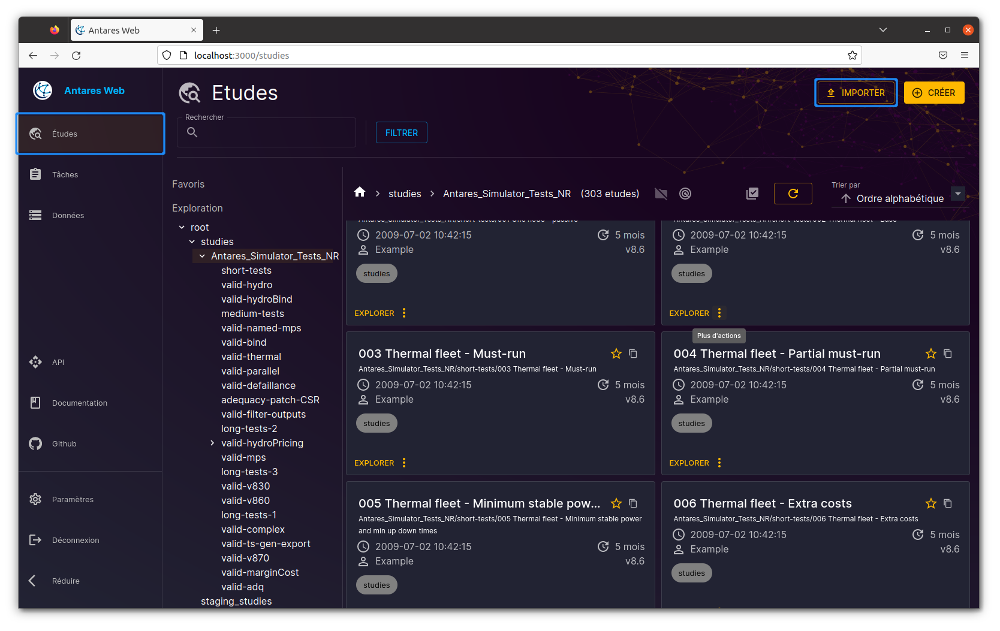
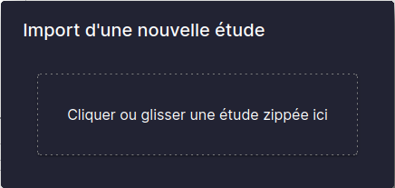
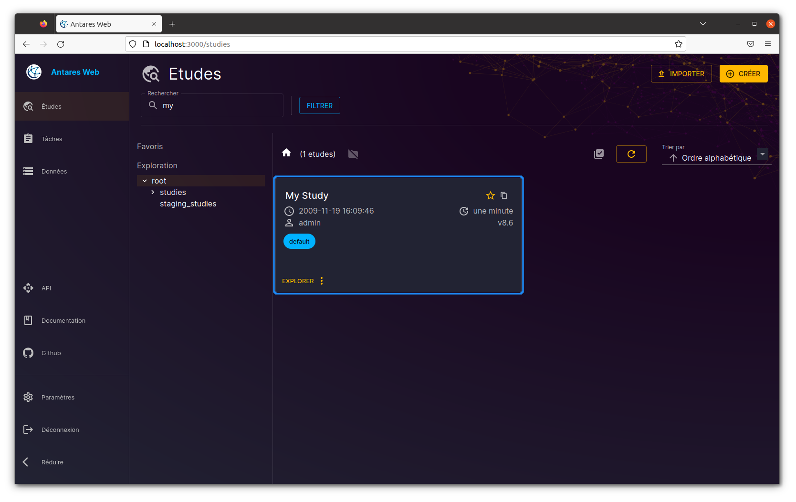

# How to Import a Compressed Study?

## Introduction

Antares Web can import a study from a compressed file (ZIP or 7z). The compressed file must contain the following files:

- `study.antares`: metadata of the study (see below)
- `layers/`: configuration of the layers
- `settings/`: study settings (`generaldata.ini`, etc.)
- `input/`: study inputs (areas, thermal clusters, binding constraints, etc.)

The compressed file can contain additional files:

- `Desktop.ini`: the Windows desktop settings.
- `users/`: the users' data, including xpansion settings.
- `output/`: the output of the study
- etc.

The `study.antares` file is a text file in the INI format, containing the metadata of the study. Example:

```ini
[antares]
version = 860
caption = 000 Free Data Sample
created = 1525354818
lastsave = 1696057404
author = John DOE
```

After import, the study is available as a managed study in the `default` workspace.
The metadata (version, caption, and author) are preserved, and the creation date is updated to the current date.

## Importing a Study in Antares Web

To import a study into Antares Web, follow these steps from the "Studies" view:

Click the "Import" button in the "Studies" view:



The import dialog box will appear. Click the "Browse" button to select the compressed file to import:



You can also drag and drop the compressed file into the dialog box.

Once imported, you can see the study in the list of studies. Select the "default" workspace to view the imported study.
You can also search for the study by name using the search input.



> **NOTE:** The properties of the imported study can be modified by clicking on the "More options" button and
> selecting "Properties". You can change the study name, permission, and metadata.
> Refer to the [Customize Study Properties](studies-create.md#customize-study-properties) paragraph
> for more information.

> **NOTE:** It is not possible to modify the version of a study after its import,
> but you can still upgrade the version of the study.
> Refer to the [How to Upgrade a Study?](studies-upgrade.md) section for more information.

## Importing a Study Using the API Endpoint

The following Python script demonstrates how to import a study using the API endpoint `POST /v1/studies/_import`:

You need to provide the following parameters:

- `study`: binary data of the compressed file to import
- `groups`: list of groups to which the study will be assigned (optional)

Make sure you have the correct API URL and a valid authentication token.

```python
import httpx  # or requests

URL = "https://antares-web/api"
TOKEN = "<your authentication token>"

with open("perso/new_study.zip", mode="rb") as fd:
    with httpx.Client(verify=False, headers={"Authorization ": f"Bearer {TOKEN}"}) as client:
        res = client.post(
            f"{URL}/v1/studies/_import",
            files={"study": fd},
            params={"groups": "foo,bar"},
        )

res.raise_for_status()
study_id = res.json()
```

The script above imports the compressed file `perso/new_study.zip` and assigns the study to the groups `foo` and `bar`.

Here is a breakdown of what each part of the code does:

1. `import httpx`: This line imports the `httpx` library, which is used for making HTTP requests in Python.
   Alternatively, the `requests` library can be used instead of `httpx` for the same purpose.

2. `URL = "https://antares-web/api"`: This line sets the URL to which the POST request will be made.
   You need to provide the right URL according to your own Antares Web server.

3. `TOKEN = "<your authentication token>"`: This line sets the authentication token that will be used in the request.
   You should replace `<your authentication token>` with your actual authentication token.

4. The `with open("perso/new_study.zip", mode="rb") as fd:` block opens the specified compressed file in binary mode.

5. The `with httpx.Client(verify=False, headers=...) as client:` block creates an HTTP client.
   The `verify=False` argument is used to disable SSL certificate verification.
   The `headers={"Authorization ": f"Bearer {TOKEN}"}` argument sets authentication token.

6. `res = client.post(...)` makes a POST request to the specified URL with the provided parameters.
   It sends the file contents, sets the headers with the authentication token, and adds query parameters.

7. `res.raise_for_status()` checks if the response from the server indicates an error.
   If an error is detected, it raises an exception.
   You may have the HTTP error 415 if the file is not a valid ZIP of 7z file.

8. `study_id = res.json()` parses the response from the server, assuming it is in JSON format,
   and assigns it to the variable `study_id`.

See also:

- ["User account & api tokens"](../../user-guide/1-interface.md#user-account-and-api-tokens) in the user guide.

## See also

- [How to Create a New Study?](studies-create.md) -- Create a new study in Antares Web
- [How to Upgrade a Study?](studies-upgrade.md) -- Upgrade a study to a recent version
- How to Run a study simulation? - Run a simulation on a study
