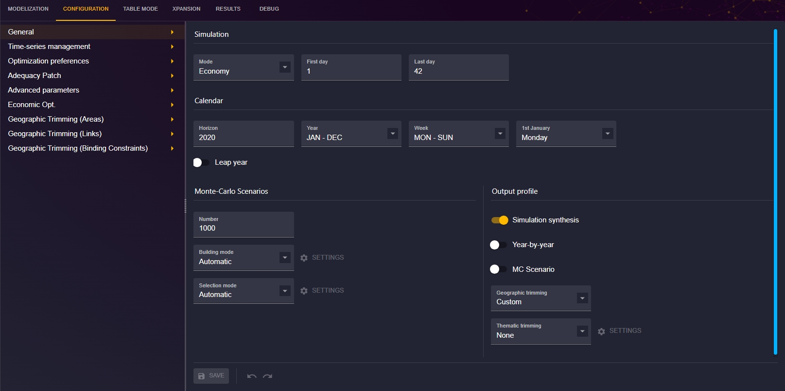
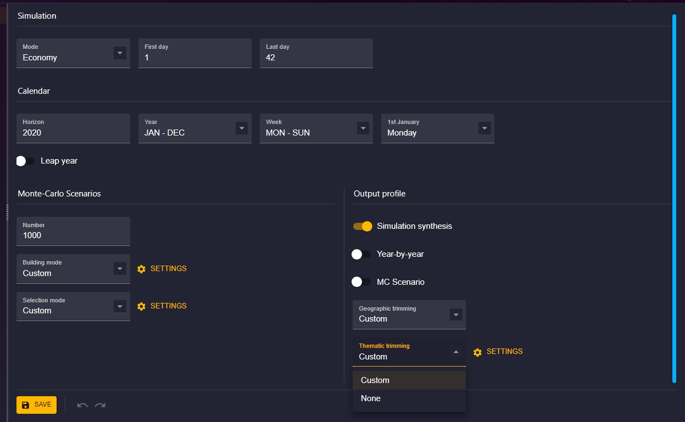
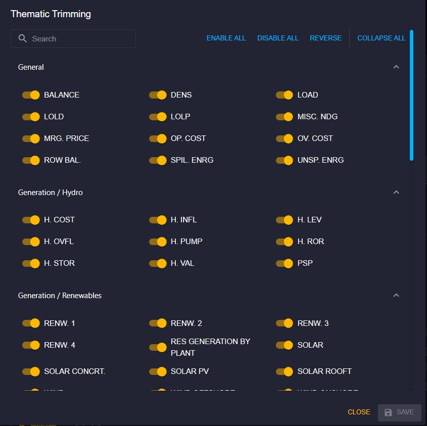
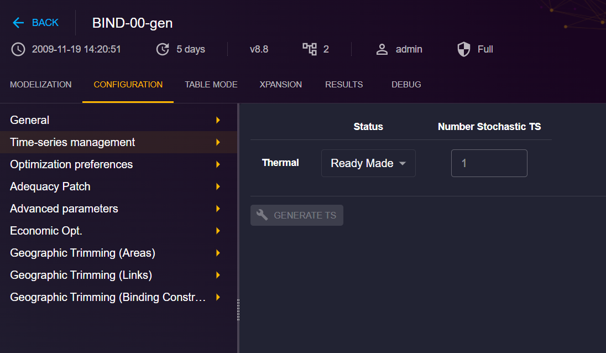
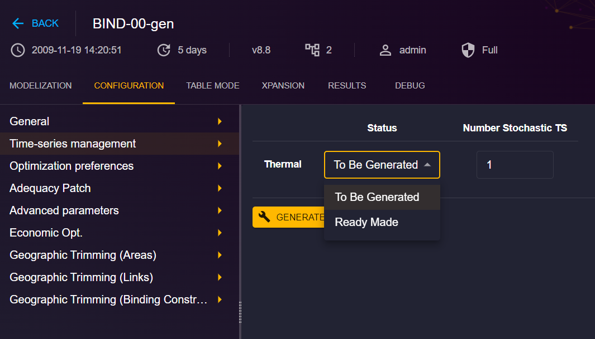
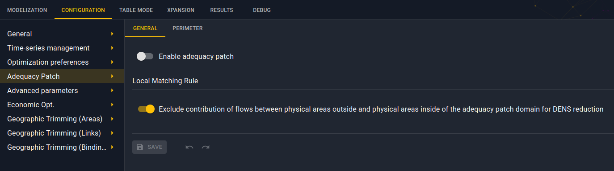
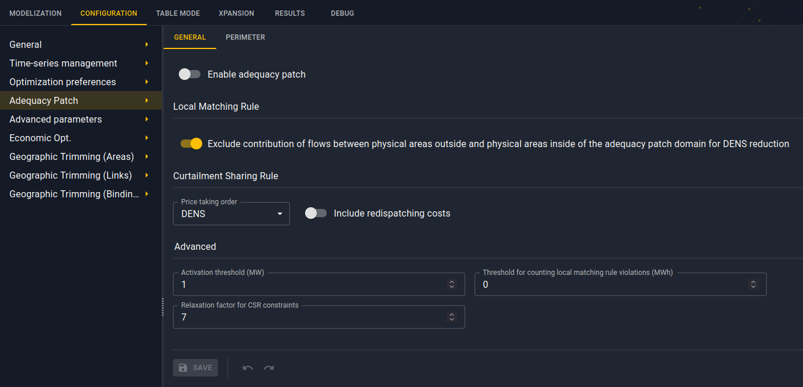

# Simulation Configuration
**_This section is under construction_**

## Introduction

This documentation is dedicated to configuring simulation in the Antares Web application.

To access the configuration of simulation, from the "Study" view, click on the "CONFIGURATION" tab.

All the configuration are here.

## General configuration
To access the general configuration of a study :

1. From the "Study" view, click on the "CONFIGURATION" tab.
2. The first next tab is for general configuration.

Let’s focus on some options in this section.

### Building mode
> TODO

### Selection mode
> TODO

### Geographic trimming
> TODO

### Thematic trimming

To access to the thematic trimming, when you are in general configuration : 
1. Go to Output profile
2. In Thematic trimming drop-down list, choose "Custom"

3. The SETTING option just to the right will be activated, click on it to access the thematic trimming configuration

The output variables are grouped by modeling objects (links, thermal clusters, etc.).

On the thematic trimming window, you will find the following elements:

- **Search bar:** You can search for specific variables, this will return all variables that match the criteria you entered in the search bar.
- **Selection option:** You will find options allowing you to activate or deactivate all the variables or even to fold all the variable groups. You can unfold a specific group manually.

The detailed configuration is available in the [Antares Simulator documentation](https://antares-simulator.readthedocs.io/en/stable/user-guide/ts-generator/04-parameters/#general-parameters).

## Time-series management

To access to Time-series management : 
1. From the "Study" view, click on the "CONFIGURATION" tab
2. The second next tab is for time series management.

In this view you can generate time series for all thermals clusters. Choose "To be Generated" and set the number stochastics TS you want. And clic on GENERATE TS.

It'll create a task you can monitor on the Tasks view. The TS generate are visible on Availability tab of the thermal cluster of the study.

A new library [antares-timeseries-generation](https://github.com/AntaresSimulatorTeam/antares-timeseries-generation) was created to generate time series for clusters.

## Optimization preferences
> TODO

## Adequacy Patch
The **Adequacy Patch** tab in the **Configurations** is available for studies that have a version >= 8.3.

### For 8.3 and 8.4 
Only two configurations are available:

- enable adequacy patch.
- exclude contribution of flows between areas. Its default value is set at true.

### For 8.5 and later versions
All adequacy patch configurations are available:

- enable adequacy patch.
- exclude contribution of flows between areas. Its default value is set at true.
- price taking order. Its default value is set at DENS.
- inclusion of redispatching costs.
- activation threshold. Its default value is set at 1.
- threshold for counting local matching rule violations. Its default value is set at 0.
- relaxation factor for csr constraints. Its default value is set at 7.

## Advanced parameters
> TODO

## Economic Opt.
> TODO

## Geographic Trimming (Areas)
> TODO
## Geographic Trimming (Links)
> TODO
## Geographic Trimming (Binding Constraints)
> TODO
