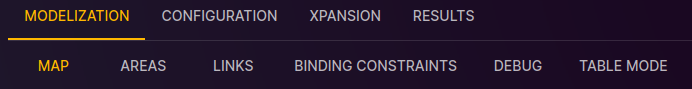

# Study Map

[⬅ Study Configuration](../2-study.md)

This page allows you to sketch the production and consumption network of your study.
You can add, edit, and delete nodes and links.

To access the map of the study:

1. From the "Study" view, click on the "MODELIZATION" tab.
2. Click on the "MAP" tab to access the page dedicated to the map.

