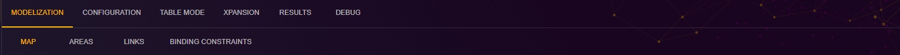
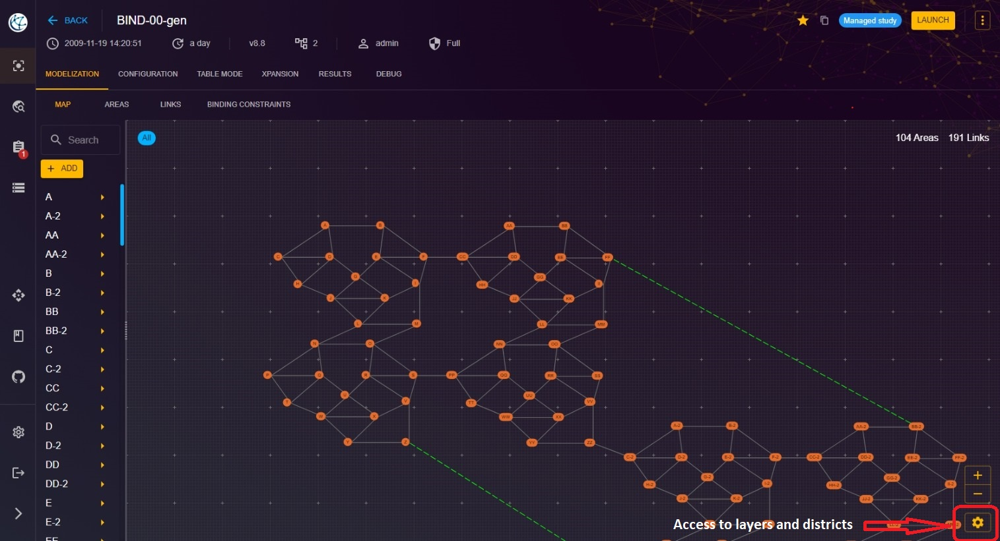
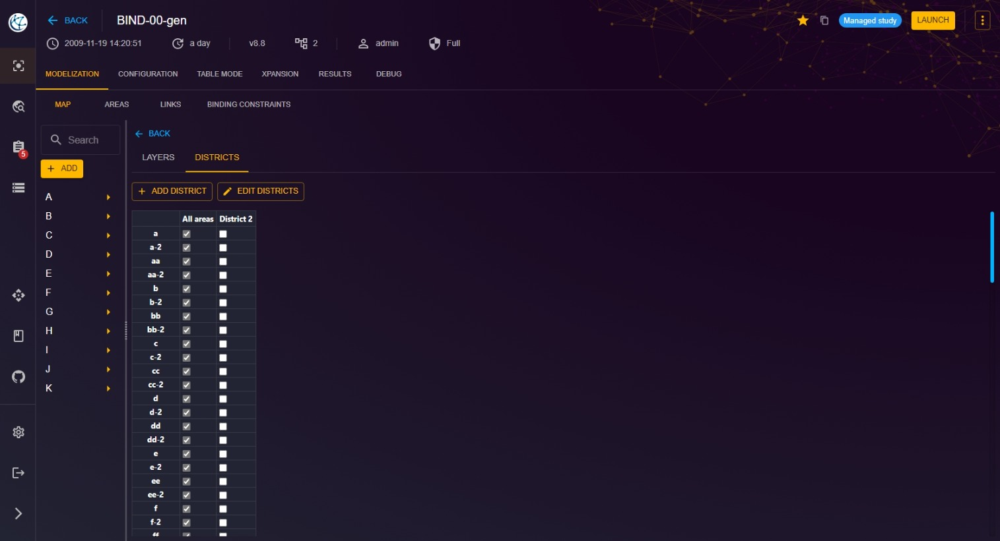

# Study Map

This page allows you to sketch the production and consumption network of your study.
You can add, edit, and delete nodes and links.

To access the map of the study:

1. From the "Study" view, click on the "MODELIZATION" tab.
2. Click on the "MAP" tab to access the page dedicated to the map.

## Layers and districts
You can also add, edit and deleate layers and districts here.
Go to bottom right of the web page and clic on the gear icon.

And this page will be opened. To delete a layer ou a district, clic on Edit.

[⬅ Back to Study Modelization](../2-study.md)