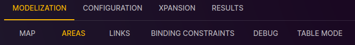

# Area Configuration

[⬅ Study Configuration](../2-study.md)

This page is dedicated to configuring areas in the Antares Web application.

To access the configuration of areas:

1. From the "Study" view, click on the "MODELIZATION" tab.
2. Click on the "AREAS" tab to access the page dedicated to areas.

## Main Topics

- [General Properties](areas/01-properties.md)
- [Load](areas/02-load.md)
- [Thermal Clusters](areas/03-thermals.md)
- [Renewables Clusters](areas/04-renewables.md)
- [Hydraulic Generators](areas/05-hydro.md)
- [Wind Generators](areas/06-wind.md)
- [Solar Generators](areas/07-solar.md)
- [Short-Term Storages](areas/08-st-storages.md)
- [Reserves](areas/09-reserves.md)
- [Miscellaneous Generators](areas/10-misc-gen.md)
