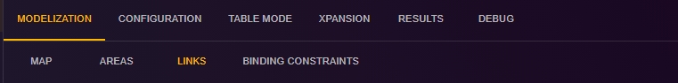

# Links Configuration

This page is dedicated to configuring links in the Antares Web application.

To access the configuration of areas:

1. From the "Study" view, click on the "MODELIZATION" tab.
2. Click on the "AREAS" tab to access the page dedicated to links.

[⬅ Back to Study Configuration](../2-study.md)

