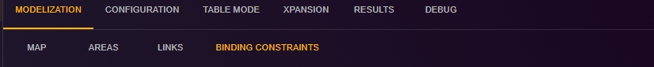

# Binding Constraints Configuration

This page is dedicated to configuring binding constraints in the Antares Web application.

To access the configuration of binding constraints:

1. From the "Study" view, click on the "MODELIZATION" tab.
2. Click on the "BINDING CONSTRAINTS" tab to access the page dedicated to binding constraints.

[⬅ Back to Study Configuration](../2-study.md)
