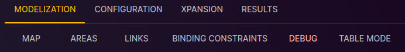

# Debug View

[⬅ Study Configuration](../2-study.md)

This page is dedicated to the debugging of the study in the Antares Web application.

To access the debug view:

1. From the "Study" view, click on the "MODELIZATION" tab.
2. Click on the "DEBUG" tab to access the page dedicated to debugging.

