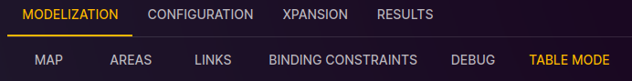

# Table Mode

[⬅ Study Configuration](../2-study.md)

This page is dedicated to the table mode, which allows you to edit the study properties in a tables.

To access the table mode:

1. From the "Study" view, click on the "MODELIZATION" tab.
2. Click on the "TABLE MODE" tab to access the page dedicated to the table mode.

