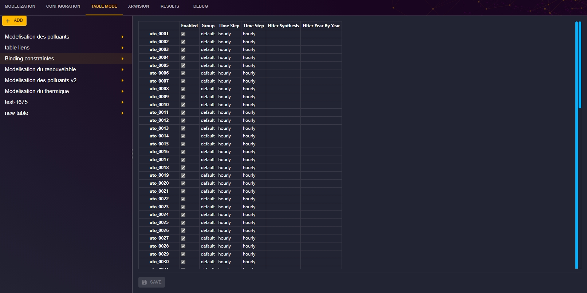

# Table Mode

This page is dedicated to the table mode, which allows you to edit the study properties in a tables.

To access the table mode:

1. From the "Study" view, click on the "TABLE MODE" tab to access the page dedicated to the table mode.

**_This section is under construction_**
> TODO : Describe here the operation and use of modeling tables.

[⬅ Back to Study Configuration](../2-study.md)