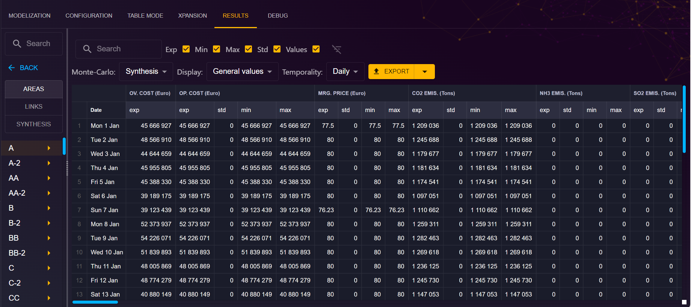

# Results
**_This section is under construction_**

This page is dedicated to the results of a simulation.

To access results :

1. From the "Study" view, click on the "RESULTS" tab.

On the results page, you will find the following elements:

- **Toolbar:** Use the toolbar to filter and quickly search in the matrix results
- **Monte-Carlo filter output profile:** choose between Synthesis ou Year-by-year output
- **Display:** choose betwen Geneal values, Thermal plants, Ren. clusters, RecordYear ou ST Storages
- **Temporality:** choose between Hourly, Daily, Weekly, Monthly or Annuel
- **EXPORT button:** You can choose to export a specfic output matrix in TSV or Excel format.

[⬅ Back to Study Configuration](../2-study.md)