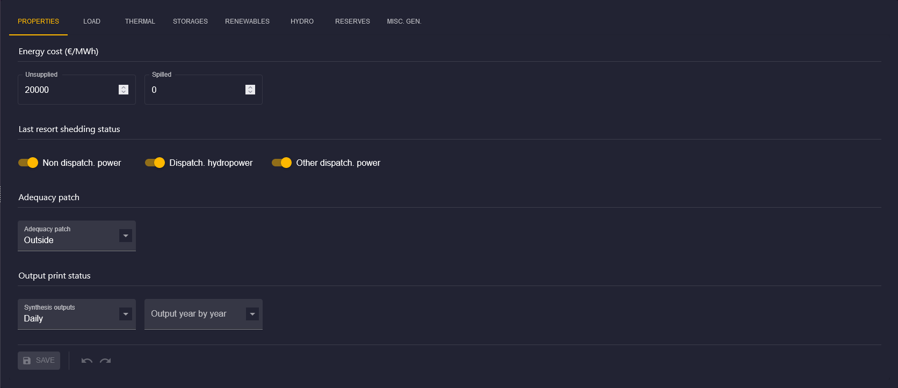

# Area General Properties

## Introduction

This documentation is dedicated to configuring the general properties of an area in the Antares Web application.

To access the configuration of an area:

1. From the "Study" view, click on the "MODELIZATION" tab.
2. Click on the "AREAS" tab, then choose an area from the sidebar.
3. Next, click on the "PROPERTIES" tab to access the page dedicated to the general properties.

## Area Properties Form

The area properties form allows you to configure the following elements for each area of your study :

- Energy cost
- Last resort shedding status
- Adequacy patch
- Output print status

[⬅ Back to Area Configuration](../02-areas.md)
