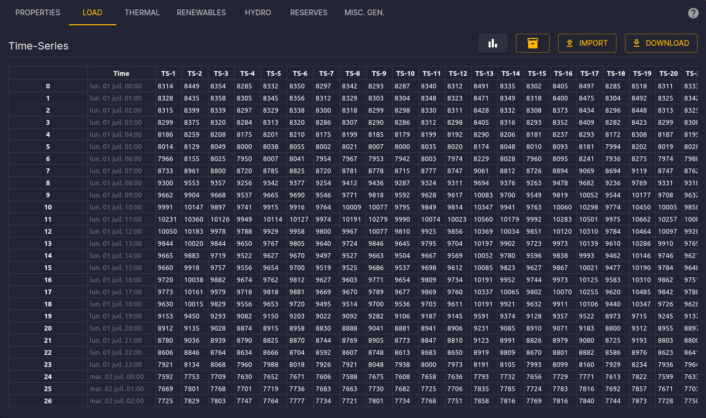

# Load Configuration

[⬅ Area Configuration](../02-areas.md)

## Introduction

This documentation is dedicated to configuring Load in the Antares Web application.

To access the configuration of Load:

1. From the "Study" view, click on the "MODELIZATION" tab.
2. Click on the "AREAS" tab, then choose an area from the sidebar.
3. Next, click on the "LOAD" tab to access the page dedicated to loads.

## Time Series Matrix

On the load page, you will find the time series matrices composed of 8760 rows (hourly for a simulation year)
and 1 column for each Monte-Carlo year.

The available commands are:

- **Assign a Matrix:** Search and assign a matrix from the matrix store to the load.
- **Import:** Drag and drop a TSV file to update the time series matrices.
- **Export:** Download the current TSV file using the "Export" button.

You can edit a cell and confirm with the "Enter" key.
You can also edit a group of cells or an entire column and confirm with the "Ctrl+Enter" key combination.

The detailed configuration is available in the [Antares Simulator documentation](https://antares-simulator.readthedocs.io/en/latest/reference-guide/04-active_windows/#load).

Explore these features to customize the ST Storage settings according to the specific needs of your study.
