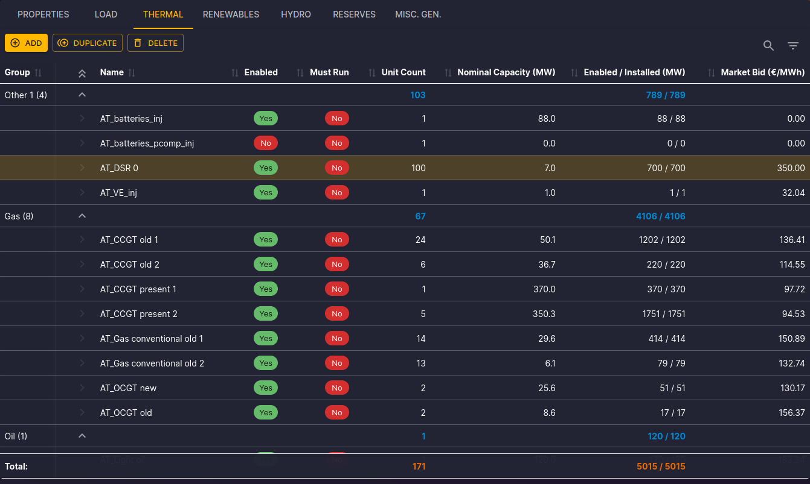
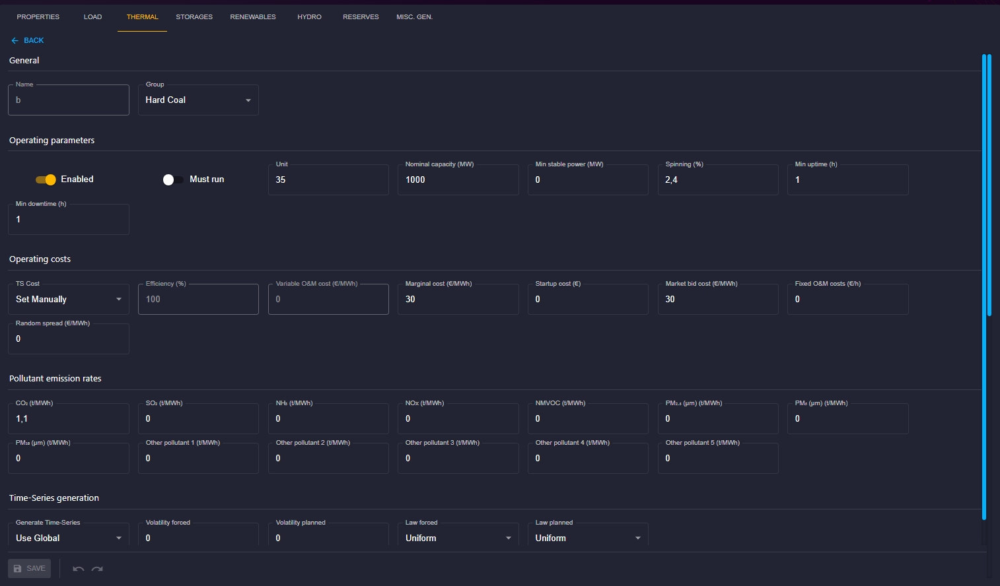
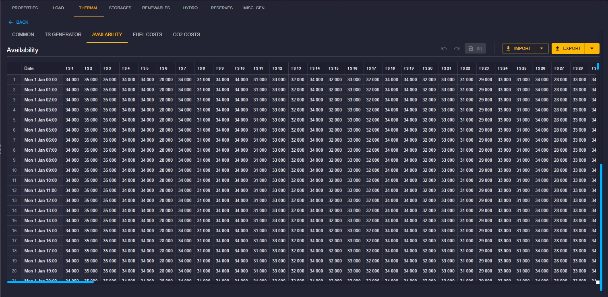

# Thermal Clusters Configuration

## Introduction

This documentation is dedicated to configuring Thermal Clusters (Thermals) in the Antares Web application.

To access the configuration of Thermals:

1. From the "Study" view, click on the "MODELIZATION" tab.
2. Click on the "AREAS" tab, then choose an area from the sidebar.
3. Next, click on the "THERMAL" tab to access the page dedicated to Thermals.

## Thermals List

On the Thermals page, you will find the following elements:

- **Command Bar:** Add, duplicate, or delete thermal clusters using the "ADD," "DUPLICATE," and "DELETE" buttons.
- **Toolbar:** Use the toolbar to filter and quickly search in the thermal clusters table.
- **Selection and Actions:** Click on a row to select a thermal cluster. You can then delete or duplicate it.

The thermal clusters table displays the following columns:

- **Group:** Name of the group to which the thermal cluster belongs.
- **Name:** Name of the thermal cluster (link to the properties form).
- **Enabled:** Indicates whether the thermal cluster is enabled.
- **Must run:** Indicates whether the thermal cluster must run.
- **Unit Count:** Number of units in the thermal cluster.
- **Nominal Capacity (MW):** Nominal capacity of the thermal cluster.
- **Enabled/Installed (MW):** Enabled/Installed capacity of the thermal cluster.
- **Market Bid (€/MWh):** Market bid of the thermal cluster.

The **Total** row displays the sum of the values in the **Unit Count** and **Enabled/Installed** columns.

## Configuration Form

Click on the name of a thermal cluster to open the properties form.

You will find the following elements:

- Click on the "Return" link to go back to the list of thermal clusters.
- Modify the values and click "Save" to confirm the changes.
- Use the "↶" buttons to undo changes and "↷" to redo them, confirm the modification with "Save."

## Time Series Matrices

You will find at the bottom of the page differents tabs for matrix : 
- COMMON : used to define the cluster's technico-economic characteristics
- TS GENERATOR : used to set the parameters of the stochastic generator
- AVAILABILITY : displays the "ready-made" 8760-hour time-series available for simulation purposes
- FUEL COSTS : used in case of TS Cost have the value "Use cost Timeseries"
- CO2 COSTS : used in case of TS Cost have the value "Use cost Timeseries"

The available commands are:

- **IMPORT > From database:** Search and assign a matrix from the matrix store to Thermal Clusters.
- **IMPORT > From a file:** Drag and drop a TSV or CSV file to update the time series matrices.
- **Export:** Download the current TSV file using the "Export" button. You can also download the file in Excel format, choose this in the button dropdown list.

You can edit a cell and confirm with the "Enter" key. You can also edit a group of cells or an entire column and confirm with the "Ctrl+Enter" key combination.

The detailed configuration is available in the [Antares Simulator documentation](https://antares-simulator.readthedocs.io/en/stable/user-guide/solver/02-inputs/#thermal).

[⬅ Back to Area Configuration](../02-areas.md)
