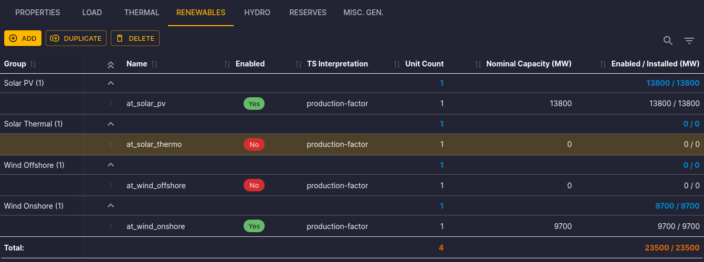
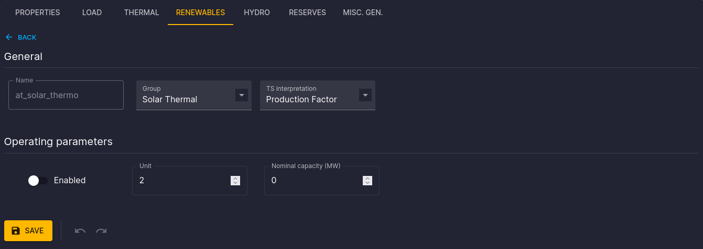
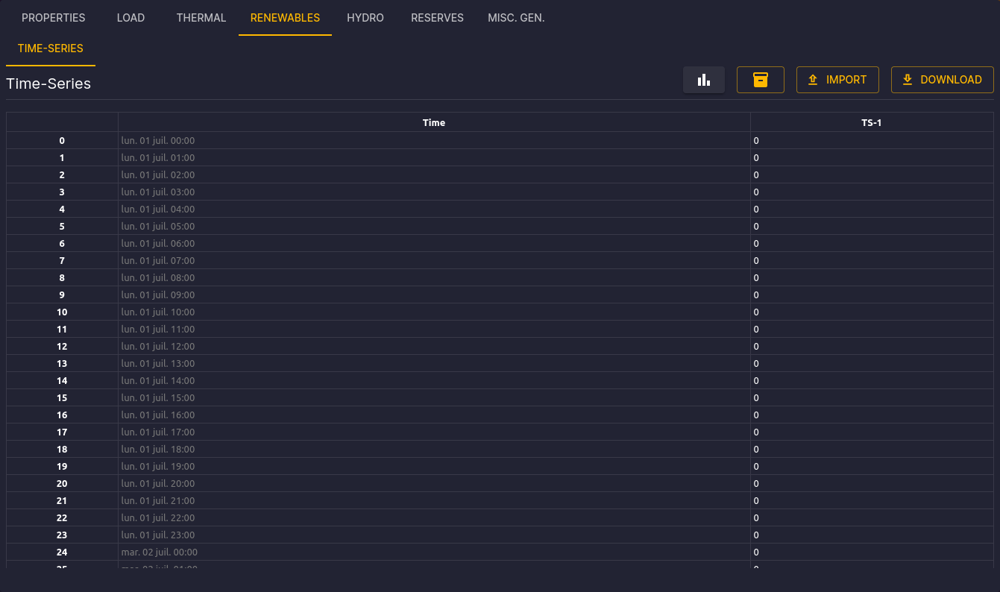

# Renewable Clusters Configuration

[⬅ Area Configuration](../02-areas.md)

## Introduction

This documentation is dedicated to configuring Renewable Clusters (Renewables) in the Antares Web application.

To access the configuration of Renewables:

1. From the "Study" view, click on the "MODELIZATION" tab.
2. Click on the "AREAS" tab, then choose an area from the sidebar.
3. Next, click on the "RENEWABLE" tab to access the page dedicated to Renewables.

## Renewable List

On the Renewables page, you will find the following elements:

- **Command Bar:** Add, duplicate, or delete renewable clusters using the "Add," "Duplicate," and "Delete" buttons.
- **Toolbar:** Use the toolbar to filter and quickly search in the renewable clusters table.
- **Selection and Actions:** Click on a row to select a renewable cluster. You can then delete or duplicate it.

The renewable clusters table displays the following columns:

- **Group:** Name of the group to which the renewable cluster belongs.
- **Name:** Name of the renewable cluster (link to the properties form).
- **Enabled:** Indicates whether the renewable cluster is enabled.
- **TS Interpretation:** Indicates whether the time series are interpreted as a production or a consumption.
- **Unit Count:** Number of units in the renewable cluster.
- **Nominal Capacity (MW):** Nominal capacity of the renewable cluster.
- **Enabled/Installed (MW):** Enabled/Installed capacity of the renewable cluster.

The **Total** row displays the sum of the values in the **Unit Count** and **Enabled/Installed** columns.

## Configuration Form

Click on the name of a renewable cluster to open the properties form.

You will find the following elements:

- Click on the "Return" link to go back to the list of renewable clusters.
- Modify the values and click "Save" to confirm the changes.
- Use the "↶" buttons to undo changes and "↷" to redo them, confirm the modification with "Save."

## Time Series Matrices

In the tabs, you will find time series matrices composed of 8760 rows (hourly for a simulation year).

The available commands are:

- **Assign a Matrix:** Search and assign a matrix from the matrix store to Renewable Clusters.
- **Import:** Drag and drop a TSV file to update the time series matrices.
- **Export:** Download the current TSV file using the "Export" button.

You can edit a cell and confirm with the "Enter" key. You can also edit a group of cells or an entire column and confirm with the "Ctrl+Enter" key combination.

The detailed configuration is available in the [Antares Simulator documentation](https://antares-simulator.readthedocs.io/en/latest/reference-guide/04-active_windows/#renewable).
