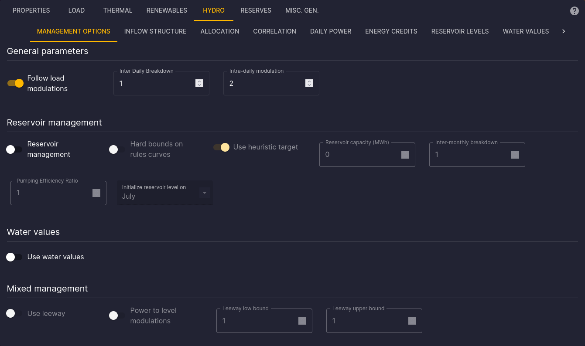
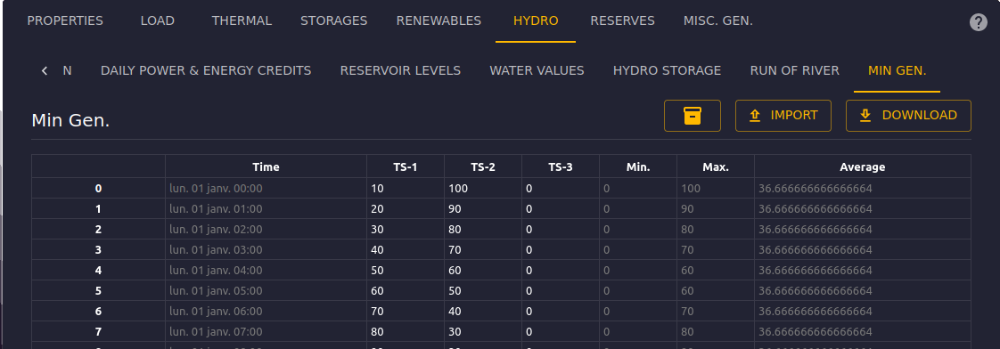

# Hydraulic Generators Configuration

[⬅ Area Configuration](../02-areas.md)

## Introduction

This documentation is dedicated to configuring hydraulic generators (Hydro) in the Antares Web application.

To access the configuration of Hydro:

1. From the "Study" view, click on the "MODELIZATION" tab.
2. Click on the "AREAS" tab, then choose an area from the sidebar.
3. Next, click on the "HYDRO" tab to access the page dedicated to hydraulic generators.

## Management options

This tab allows you to configure the management options of the hydraulic generators.

## Inflow Structure

This tab allows you to configure the inflow pattern time series and the overall monthly hydro parameters.

> TODO

## Allocation

This tab allows you to configure the allocation coefficients for each area.

> TODO

## Correlation

This tab allows you to configure the correlation coefficients between the current area and the other areas.

> TODO

## Daily Power

This tab allows you to configure the daily generating power and the pumping power of the hydraulic generators.

> TODO

## Energy Credits

This tab allows you to configure the energy credits time series of the hydraulic generators.

> TODO

## Reservoir Levels

This tab allows you to configure the reservoir levels time series of the hydraulic generators.

> TODO

## Water Values

This tab allows you to configure the water values time series of the hydraulic generators.

> TODO

## Hydro Storage

This tab allows you to configure the hydro storage time series of the hydraulic generators.

> TODO

## Run of River

This tab allows you to configure the run of river time series of the hydraulic generators.

## Minimum Generation

The "Min Gen." tab is dedicated to configuring the minimum generation levels of the hydraulic generators. This tab presents a time series that represents the minimum hourly production for one or more Monte-Carlo years.

