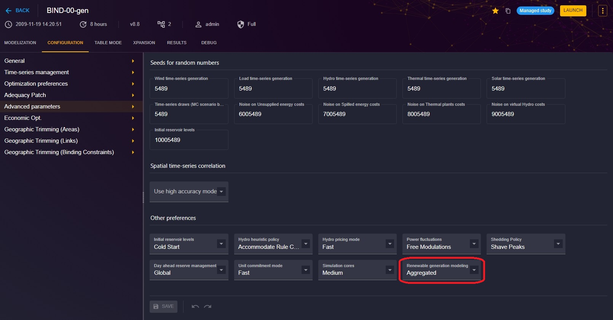

# Wind Generators Configuration

[⬅ Area Configuration](../02-areas.md)

## Introduction

This documentation is dedicated to configuring wind generators (Wind) in the Antares Web application.

To access the configuration of Wind:

1. From the "Study" view, click on the "MODELIZATION" tab.
2. Click on the "AREAS" tab, then choose an area from the sidebar.
3. Next, click on the "WIND" tab to access the page dedicated to wind generators.

You will see here 8760-hour time-series already available for simulation purposes. You can update this data. 

This tab is visible only when the study configuration have the value "Aggregated" on Advanced parameters > Renewable generation modeling.

