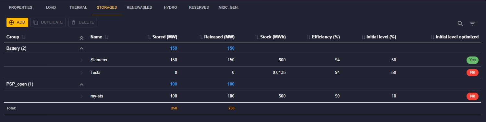
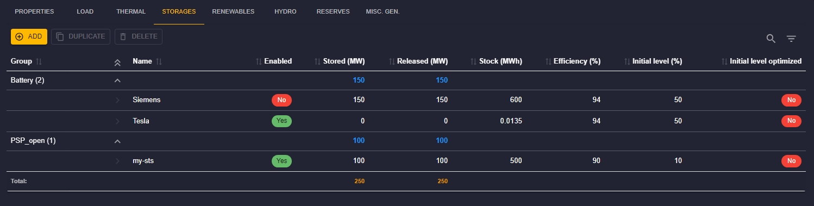
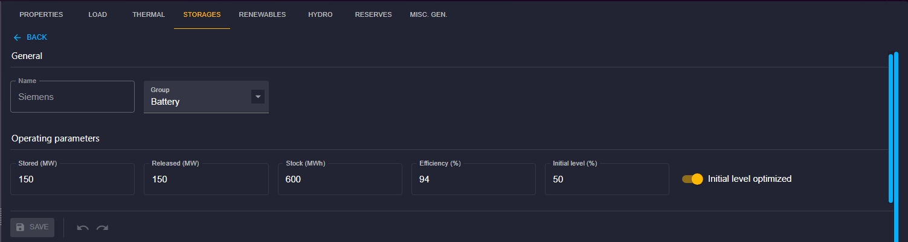
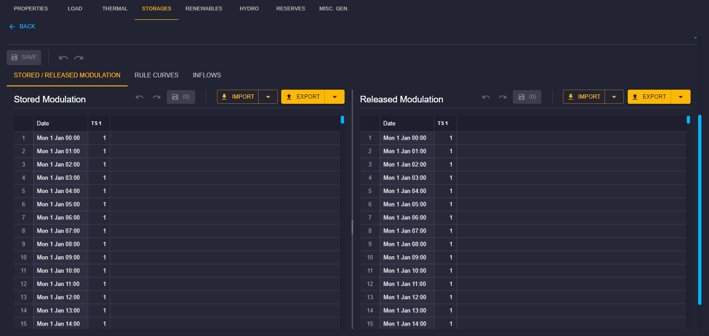

# Short-Term Storage Configuration

## Introduction

This documentation is dedicated to configuring short-term storage (ST Storage) in the Antares Web application.
Please note that this feature is available starting from version 8.6 of the studies.

To access the configuration of ST storages:

1. From the "Study" view, click on the "MODELIZATION" tab.
2. Click on the "AREAS" tab, then choose an area from the sidebar.
3. Next, click on the "STORAGES" tab to access the page dedicated to ST storages.

## ST Storage List

_Screenshot for a study version under 8.8_

_Screenshot for a study version in 8.8_

On the ST storages page, you will find the following elements:

- **Command Bar:** Add, duplicate, or delete storages using the "Add," "Duplicate," and "Delete" buttons.
- **Toolbar:** Use the toolbar to filter and quickly search in the storages table.
- **Selection and Actions:** Click on a row to select a storage. You can then delete or duplicate it.

The storages table displays the following information:

- **Group:** Name of the group to which the storage belongs.
- **Name:** Name of the storage (link to the properties form).
- **Enabled:** Indicates whether the storage is enable or disable. Only from version 8.8 of studies.
- **Stored (MW):** Withdrawal power of the storage.
- **Released (MW):** Injection power of the storage.
- **Stock (MWh):** Reservoir capacity of the storage.
- **Efficiency (%):** Efficiency of the storage.
- **Initial Level (%):** Initial level of the storage.
- **Initial Level Optimized:** Indicates whether the initial level of the storage is optimized.

The **Total** row displays the sum of the values in the **Stored** and **Released** columns.

### New update
From version 8.8 of the studies, a new parameter has been added to the short-term storage objects. This is an option that allows you to enable/disable storage.
Note that this option is not valid for studies lower than version 8.8. To be able to use it, you must update your study to at least version 8.8.

## Configuration Form

Click on the name of a storage to open the properties form.

_Screenshot for a study version under 8.8_

You will find the following elements:

- Click on the "Return" link to go back to the list of storages.
- Modify the values and click "Save" to confirm the changes.
- Use the "↶" buttons to undo changes and "↷" to redo them, confirm the modification with "Save."

## Time Series Matrices

In the tabs, you will find time series matrices composed of 8760 rows (hourly for a simulation year).

The available commands are:

- **IMPORT > From database:** Search and assign a matrix from the matrix store to Thermal Clusters.
- **IMPORT > From a file:** Drag and drop a TSV or CSV file to update the time series matrices.
- **Export:** Download the current TSV file using the "Export" button. You can also download the file in Excel format, choose this in the button dropdown list.

You can edit a cell and confirm with the "Enter" key. You can also edit a group of cells or an entire column and confirm with the "Ctrl+Enter" key combination.

The detailed configuration is available in the [Antares Simulator documentation](https://antares-simulator.readthedocs.io/en/stable/user-guide/solver/02-inputs/#storages).

[⬅ Back to Area Configuration](../02-areas.md)
